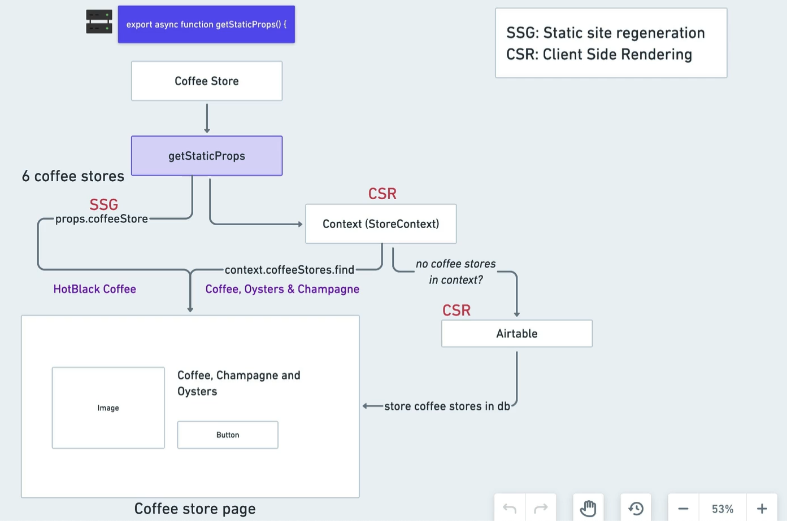

# nextjs-mastery-2022

> Learn Next JS from industry experts using modern best practices. The only Next JS tutorial + projects course you need to learn Next JS, build enterprise-level React applications from scratch & get hired as a Next.js Developer in 2022.
>
> 立个 Flag 👉　实践 💓 **`Algebraic Effects`** + **`DDD`** 💝

